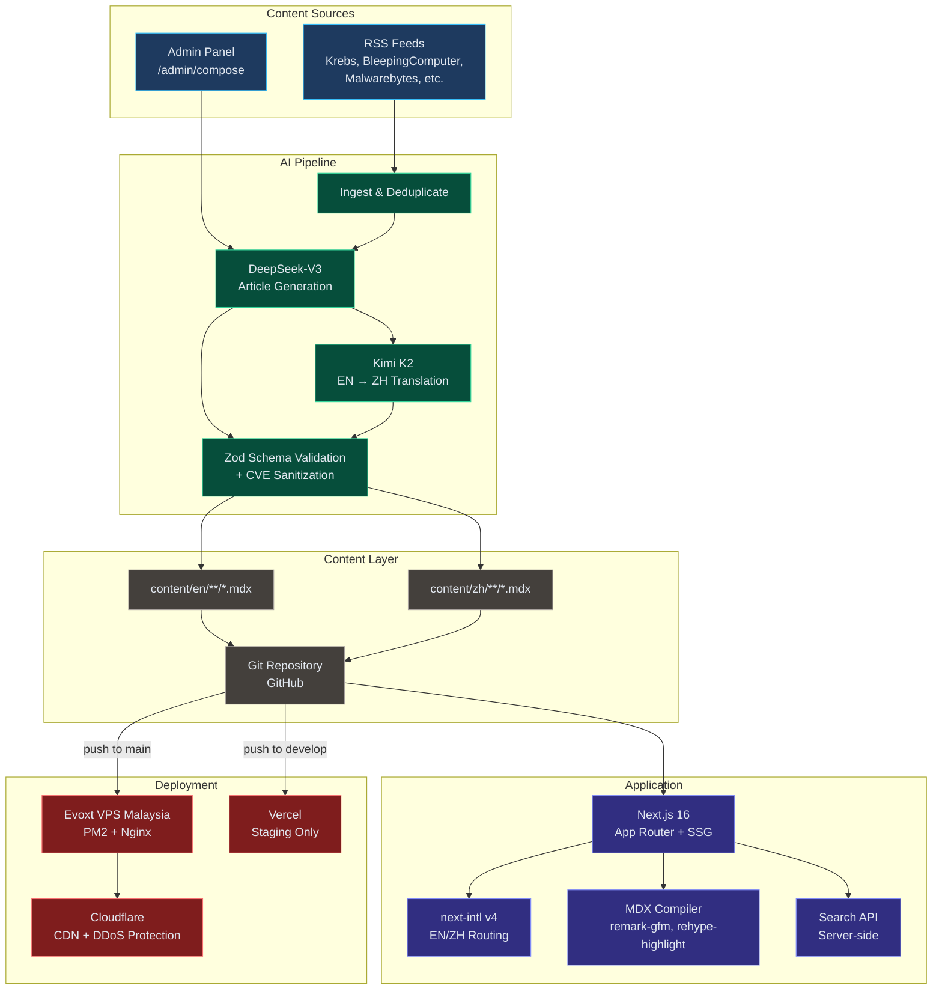
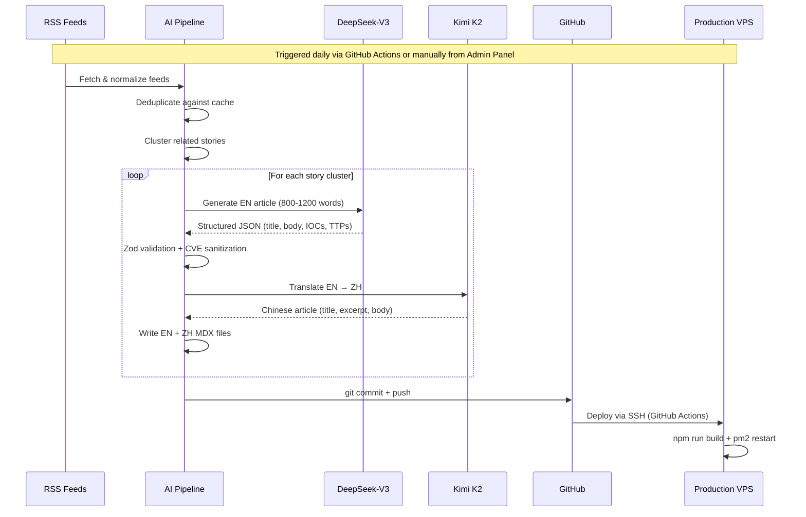
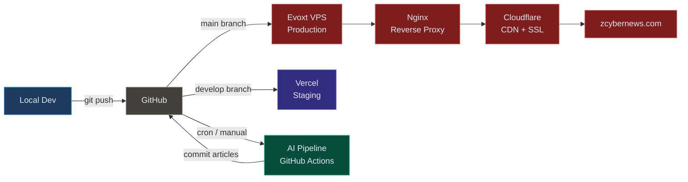

<div align="center">

# ZCyberNews

Watch 40+ security channel, so you don't have to. WIP.

[](https://github.com/jamesKhor/Zcybernews/actions/workflows/deploy-vps.yml)

[Live Site](https://zcybernews.com) | [English](https://zcybernews.com/en) | [Chinese](https://zcybernews.com/zh)

</div>

---

## Architecture



## AI Content Pipeline



## Tech Stack

| Layer                | Technology                          | Purpose                        |
| -------------------- | ----------------------------------- | ------------------------------ |
| **Framework**        | Next.js 16 (App Router, TypeScript) | SSG + server routes            |
| **Styling**          | Tailwind CSS v4 + shadcn/ui         | Dark cybersecurity theme       |
| **Content**          | gray-matter + next-mdx-remote       | Git-based MDX CMS              |
| **i18n**             | next-intl v4                        | EN/ZH bilingual routing        |
| **AI — Articles**    | DeepSeek-V3                         | Fast, cheap article generation |
| **AI — Translation** | Kimi K2 (Moonshot AI)               | Superior Chinese quality       |
| **AI — Fallback**    | OpenRouter free models              | Zero-cost fallback tier        |
| **Search**           | Server-side API                     | Full-text article search       |
| **Auth**             | NextAuth v5 + bcrypt                | Admin panel authentication     |
| **Validation**       | Zod v4                              | Frontmatter + pipeline schemas |
| **Deploy — Prod**    | Evoxt VPS (Malaysia) + PM2 + Nginx  | No serverless timeout limits   |
| **Deploy — Staging** | Vercel                              | Preview deployments            |
| **CDN**              | Cloudflare (free tier)              | DDoS protection + edge caching |
| **CI/CD**            | GitHub Actions                      | Auto-deploy on push to `main`  |

## Features

### Threat Intelligence

- **IOC Tables** — Sortable, filterable, with CSV export and copy-to-clipboard
- **MITRE ATT&CK Matrix** — Tactic columns linking to attack.mitre.org
- **CVE Auto-linking** — Inline CVE cards with live NVD data lookup
- **Severity Badges** — Critical/High/Medium/Low visual indicators
- **Threat Actor Cards** — Origin, campaigns, affected sectors

### Content Platform

- **Bilingual** — Full EN/ZH support with locale-aware routing
- **WeChat Detection** — Auto-redirects WeChat browser users to `/zh`
- **Search** — Cmd/Ctrl+K search dialog with server-side API
- **RSS & WeChat Feeds** — `/api/feed` (Atom) and `/api/wechat?locale=zh` (JSON)
- **SEO** — JSON-LD structured data, XML sitemap, hreflang tags, OG images per category
- **Dark Theme** — Purpose-built cybersecurity aesthetic

### Admin Panel (`/admin`)

- **Feed Reader** — Browse RSS sources, select stories to synthesize
- **AI Composer** — Model picker (DeepSeek/Kimi/Auto), length control, custom prompts
- **Streaming Generation** — Live NDJSON status with per-model progress
- **One-Click Publish** — EN only or EN+ZH (auto-translates via Kimi)
- **Article Management** — Edit, preview, and manage published content

### AI Pipeline Safeguards

- **CVE Validation** — 3-layer defense against hallucinated CVE IDs (prompt rules, Zod schema filtering, body text sanitization)
- **Language Validation** — Detects and strips CJK characters from EN articles
- **Schema Enforcement** — Every AI-generated article validated against Zod schema
- **Deduplication** — Cache-based dedup prevents duplicate article generation

## Project Structure

```
zcybernews/
├── app/
│   ├── [locale]/              # EN/ZH routes
│   │   ├── articles/          # Article listing + detail pages
│   │   ├── threat-intel/      # Threat intel reports
│   │   ├── categories/        # Category pages
│   │   └── tags/              # Tag pages
│   ├── admin/                 # Admin panel (auth-protected)
│   └── api/                   # API routes (feed, search, CVE, admin)
├── components/
│   ├── articles/              # ArticleCard, ArticleMeta
│   ├── threat-intel/          # IOCTable, MitreMatrix
│   ├── search/                # SearchDialog (Cmd+K)
│   └── layout/                # Header, Footer
├── content/
│   ├── en/posts/              # English articles (.mdx)
│   ├── en/threat-intel/       # English TI reports (.mdx)
│   ├── zh/posts/              # Chinese articles (.mdx)
│   └── zh/threat-intel/       # Chinese TI reports (.mdx)
├── scripts/
│   ├── pipeline/              # AI content pipeline orchestrator
│   ├── ai/                    # Provider config, prompts, schemas
│   └── utils/                 # Cache, dedup, rate limiting
├── lib/                       # Content helpers, MDX compiler, types
├── messages/                  # i18n strings (en.json, zh.json)
├── proxy.ts                   # Locale + WeChat middleware
└── auth.ts                    # NextAuth v5 configuration
```

## Getting Started

### Prerequisites

- Node.js 22+
- npm 10+

### Installation

```bash
git clone https://github.com/jamesKhor/Zcybernews.git
cd Zcybernews
npm install
cp .env.example .env.local
```

### Environment Variables

Edit `.env.local` with your API keys. See [`.env.example`](.env.example) for the full list. Minimum required:

```bash
NEXTAUTH_SECRET=          # openssl rand -base64 32
ADMIN_USERNAME=           # Admin panel login
ADMIN_PASSWORD_HASH=      # node -e "require('bcryptjs').hash('pass',12).then(console.log)"
DEEPSEEK_API_KEY=         # Article generation
KIMI_API_KEY=             # Chinese translation
```

### Development

```bash
npm run dev               # http://localhost:3000 (redirects to /en)
npm run build             # Production build
npx tsc --noEmit          # Type-check only
```

### Running the AI Pipeline

```bash
# Generate articles from RSS feeds
npx tsx scripts/pipeline/index.ts --max-articles=5

# Dry run (fetch feeds but don't generate)
npx tsx scripts/pipeline/index.ts --dry-run

# Translate existing EN articles to ZH
npx tsx scripts/translate-existing.ts
```

## Deployment



| Branch      | Target               | Trigger                                    |
| ----------- | -------------------- | ------------------------------------------ |
| `main`      | Evoxt VPS (Malaysia) | Auto on push — SSH + build + PM2 restart   |
| `develop`   | Vercel               | Auto on push — staging preview             |
| Manual/Cron | GitHub Actions       | AI pipeline — generates + commits articles |

## Article Frontmatter

Every MDX article is validated against a Zod schema. Required fields:

```yaml
---
title: "Article Title"
slug: "url-slug"
date: "2026-04-13"
excerpt: "1-2 sentence summary"
category: "threat-intel" # threat-intel | vulnerabilities | malware | industry | tools | ai
tags: ["ransomware", "apt"]
language: "en" # en | zh
author: "ZCyberNews"
draft: false
---
```

Optional threat intelligence fields: `severity`, `cvss_score`, `cve_ids`, `threat_actor`, `iocs`, `ttp_matrix`, and more. See [`lib/types.ts`](lib/types.ts) for the full schema.

## License

All rights reserved. This is a proprietary project.

---

<div align="center">

Built with [Next.js](https://nextjs.org) | Powered by [DeepSeek](https://deepseek.com) & [Kimi](https://moonshot.cn)

</div>
