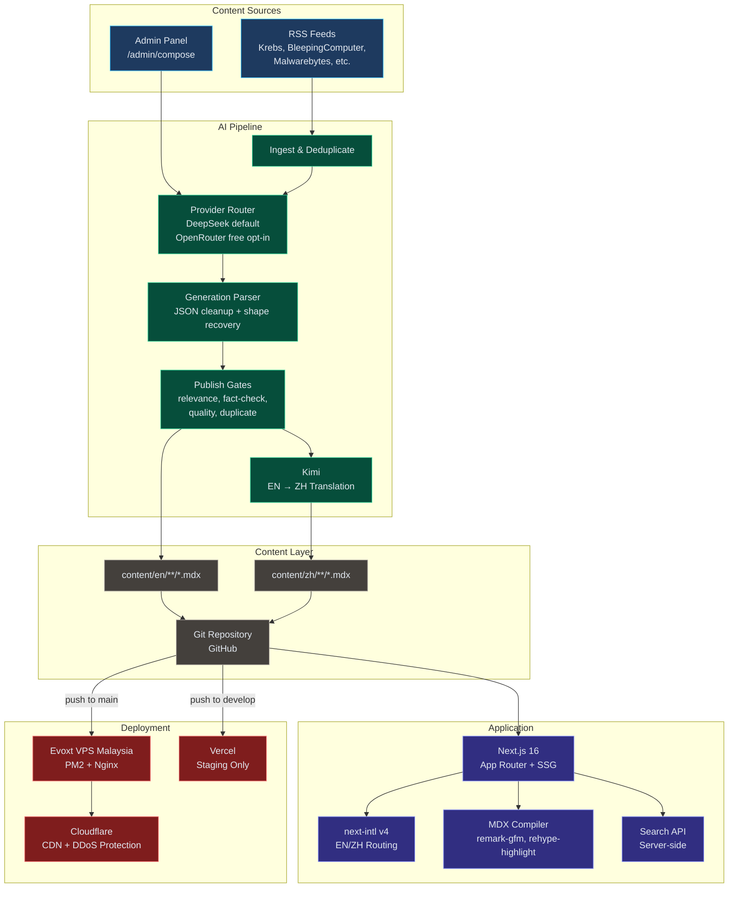
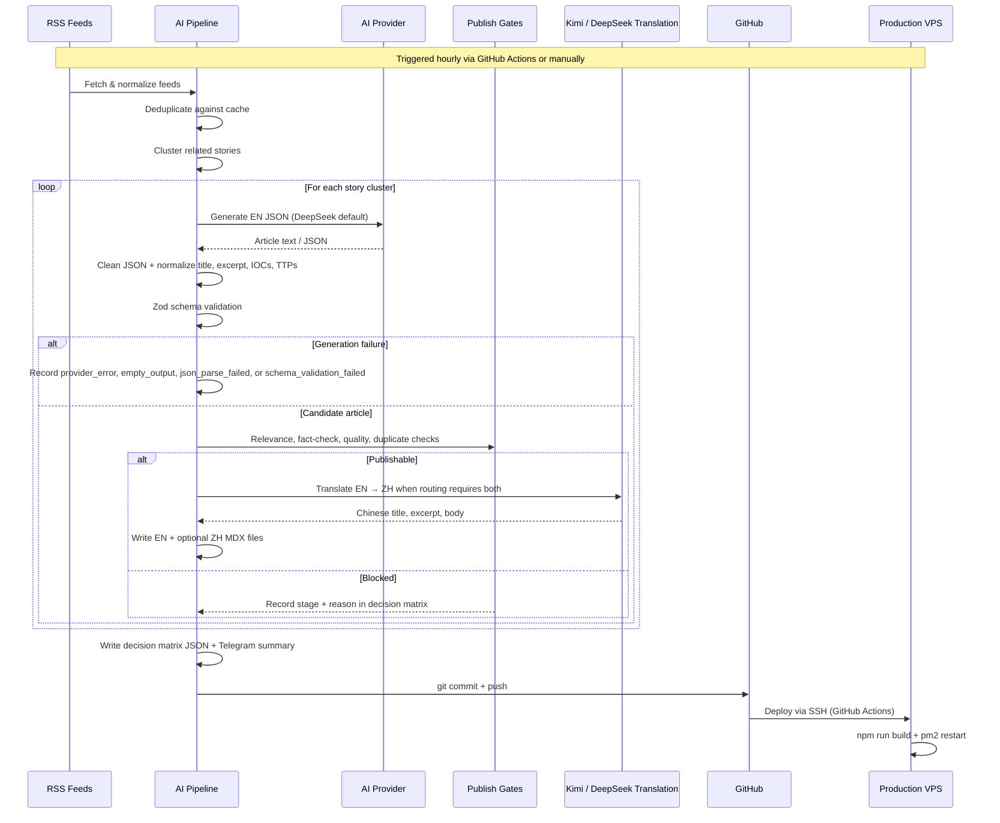
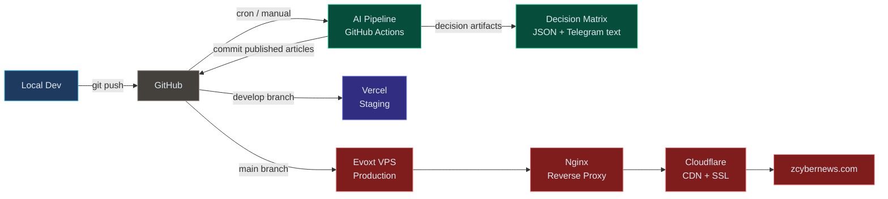

<div align="center">

# ZCyberNews

Watch 40+ security channel, so you don't have to. WIP.

[](https://github.com/jamesKhor/Zcybernews/actions/workflows/deploy-vps.yml)

[Live Site](https://zcybernews.com) | [English](https://zcybernews.com/en) | [Chinese](https://zcybernews.com/zh)

</div>

---

## Architecture


```mermaid
graph TB
    subgraph "Content Sources"
        RSS[RSS Feeds<br/>Krebs, BleepingComputer,<br/>Malwarebytes, etc.]
        ADMIN[Admin Panel<br/>/admin/compose]
    end

    subgraph "AI Pipeline"
        INGEST[Ingest & Deduplicate]
        ROUTER[Provider Router<br/>DeepSeek default<br/>OpenRouter free opt-in]
        PARSER[Generation Parser<br/>JSON cleanup + shape recovery]
        GATES[Publish Gates<br/>relevance, fact-check,<br/>quality, duplicate]
        KIMI[Kimi<br/>EN → ZH Translation]
    end

    subgraph "Content Layer"
        MDX_EN[content/en/**/*.mdx]
        MDX_ZH[content/zh/**/*.mdx]
        GIT[Git Repository<br/>GitHub]
    end

    subgraph "Application"
        NEXTJS[Next.js 16<br/>App Router + SSG]
        INTL[next-intl v4<br/>EN/ZH Routing]
        MDX_RENDER[MDX Compiler<br/>remark-gfm, rehype-highlight]
        SEARCH[Search API<br/>Server-side]
    end

    subgraph "Deployment"
        VPS[Evoxt VPS Malaysia<br/>PM2 + Nginx]
        CF[Cloudflare<br/>CDN + DDoS Protection]
        VERCEL[Vercel<br/>Staging Only]
    end

    RSS --> INGEST
    ADMIN --> ROUTER
    INGEST --> ROUTER
    ROUTER --> PARSER
    PARSER --> GATES
    GATES --> MDX_EN
    GATES --> KIMI
    KIMI --> MDX_ZH
    MDX_EN --> GIT
    MDX_ZH --> GIT
    GIT -->|push to main| VPS
    GIT -->|push to develop| VERCEL
    VPS --> CF
    GIT --> NEXTJS
    NEXTJS --> INTL
    NEXTJS --> MDX_RENDER
    NEXTJS --> SEARCH

    style RSS fill:#1e3a5f,stroke:#38bdf8,color:#e2e8f0
    style ADMIN fill:#1e3a5f,stroke:#38bdf8,color:#e2e8f0
    style INGEST fill:#064e3b,stroke:#34d399,color:#e2e8f0
    style ROUTER fill:#064e3b,stroke:#34d399,color:#e2e8f0
    style PARSER fill:#064e3b,stroke:#34d399,color:#e2e8f0
    style GATES fill:#064e3b,stroke:#34d399,color:#e2e8f0
    style KIMI fill:#064e3b,stroke:#34d399,color:#e2e8f0
    style MDX_EN fill:#44403c,stroke:#a8a29e,color:#e2e8f0
    style MDX_ZH fill:#44403c,stroke:#a8a29e,color:#e2e8f0
    style GIT fill:#44403c,stroke:#a8a29e,color:#e2e8f0
    style NEXTJS fill:#312e81,stroke:#818cf8,color:#e2e8f0
    style INTL fill:#312e81,stroke:#818cf8,color:#e2e8f0
    style MDX_RENDER fill:#312e81,stroke:#818cf8,color:#e2e8f0
    style SEARCH fill:#312e81,stroke:#818cf8,color:#e2e8f0
    style VPS fill:#7f1d1d,stroke:#f87171,color:#e2e8f0
    style CF fill:#7f1d1d,stroke:#f87171,color:#e2e8f0
    style VERCEL fill:#7f1d1d,stroke:#f87171,color:#e2e8f0
```

## AI Content Pipeline


```mermaid
sequenceDiagram
    participant RSS as RSS Feeds
    participant Pipeline as AI Pipeline
    participant Provider as AI Provider
    participant Gates as Publish Gates
    participant Kimi as Kimi / DeepSeek Translation
    participant Git as GitHub
    participant VPS as Production VPS

    Note over RSS,VPS: Triggered hourly via GitHub Actions or manually

    RSS->>Pipeline: Fetch & normalize feeds
    Pipeline->>Pipeline: Deduplicate against cache
    Pipeline->>Pipeline: Cluster related stories

    loop For each story cluster
        Pipeline->>Provider: Generate EN JSON (DeepSeek default)
        Provider-->>Pipeline: Article text / JSON
        Pipeline->>Pipeline: Clean JSON + normalize title, excerpt, IOCs, TTPs
        Pipeline->>Pipeline: Zod schema validation
        alt Generation failure
            Pipeline->>Pipeline: Record provider_error, empty_output, json_parse_failed, or schema_validation_failed
        else Candidate article
            Pipeline->>Gates: Relevance, fact-check, quality, duplicate checks
            alt Publishable
                Pipeline->>Kimi: Translate EN → ZH when routing requires both
                Kimi-->>Pipeline: Chinese title, excerpt, body
                Pipeline->>Pipeline: Write EN + optional ZH MDX files
            else Blocked
                Gates-->>Pipeline: Record stage + reason in decision matrix
            end
        end
    end

    Pipeline->>Pipeline: Write decision matrix JSON + Telegram summary
    Pipeline->>Git: git commit + push
    Git->>VPS: Deploy via SSH (GitHub Actions)
    VPS->>VPS: npm run build + pm2 restart
```

### Pipeline Decision Matrix

Each scheduled run writes `.pipeline-cache/decision-matrix.json` plus a Telegram-ready `.pipeline-cache/decision-matrix.telegram.txt`. The matrix explains why each candidate did or did not publish.

| Stage          | Pass means                                  | Block or fail reasons surfaced                                                                       |
| -------------- | ------------------------------------------- | ---------------------------------------------------------------------------------------------------- |
| `routing`      | Story is eligible for EN or EN+ZH handling  | Configured locale/SEO routing excludes it                                                            |
| `source-depth` | Source enrichment found enough material     | Warns on single-source coverage                                                                      |
| `generation`   | AI output parsed, normalized, and validated | `provider_error`, `empty_output`, `json_parse_failed`, `schema_validation_failed`, or AI self-reject |
| `relevance`    | Article is cybersecurity-relevant           | `not_cybersecurity_relevant`                                                                         |
| `fact-check`   | High-risk claims match source material      | Hallucinated CVEs, IOCs, actors, or unsupported claims                                               |
| `quality`      | Article meets publish-quality floor         | Thin word count, missing references, weak structured fields                                          |
| `translation`  | ZH output passes basic language checks      | EN-only downgrade if translation is too short or non-Chinese                                         |
| `duplicate`    | Generated article is not already covered    | Slug, title, CVE, or incident-signature match                                                        |
| `write`        | MDX files were written                      | Published EN or EN+ZH                                                                                |

## Tech Stack

| Layer                | Technology                                | Purpose                                     |
| -------------------- | ----------------------------------------- | ------------------------------------------- |
| **Framework**        | Next.js 16 (App Router, TypeScript)       | SSG + server routes                         |
| **Styling**          | Tailwind CSS v4 + shadcn/ui               | Dark cybersecurity theme                    |
| **Content**          | gray-matter + next-mdx-remote             | Git-based MDX CMS                           |
| **i18n**             | next-intl v4                              | EN/ZH bilingual routing                     |
| **AI — Articles**    | DeepSeek `deepseek-chat` via AI SDK       | Default scheduled generation                |
| **AI — Translation** | Kimi `moonshot-v1-32k`, DeepSeek fallback | Chinese article translation                 |
| **AI — Optional**    | OpenRouter free models                    | Opt-in with `PIPELINE_USE_FREE_MODELS=true` |
| **Search**           | Server-side API                           | Full-text article search                    |
| **Auth**             | NextAuth v5 + bcrypt                      | Admin panel authentication                  |
| **Validation**       | Zod v4                                    | Frontmatter + pipeline schemas              |
| **Deploy — Prod**    | Evoxt VPS (Malaysia) + PM2 + Nginx        | No serverless timeout limits                |
| **Deploy — Staging** | Vercel                                    | Preview deployments                         |
| **CDN**              | Cloudflare (free tier)                    | DDoS protection + edge caching              |
| **CI/CD**            | GitHub Actions                            | Auto-deploy on push to `main`               |

## Features

### Threat Intelligence

- **IOC Tables** — Sortable, filterable, with CSV export and copy-to-clipboard
- **MITRE ATT&CK Matrix** — Tactic columns linking to attack.mitre.org
- **CVE Auto-linking** — Inline CVE cards with live NVD data lookup
- **Severity Badges** — Critical/High/Medium/Low visual indicators
- **Threat Actor Cards** — Origin, campaigns, affected sectors

### Content Platform

- **Bilingual** — Full EN/ZH support with locale-aware routing
- **WeChat Detection** — Auto-redirects WeChat browser users to `/zh`
- **Search** — Cmd/Ctrl+K search dialog with server-side API
- **RSS & WeChat Feeds** — `/api/feed` (Atom) and `/api/wechat?locale=zh` (JSON)
- **SEO** — JSON-LD structured data, XML sitemap, hreflang tags, OG images per category
- **Dark Theme** — Purpose-built cybersecurity aesthetic

### Admin Panel (`/admin`)

- **Feed Reader** — Browse RSS sources, select stories to synthesize
- **AI Composer** — Model picker (DeepSeek/Kimi/Auto), length control, custom prompts
- **Streaming Generation** — Live NDJSON status with per-model progress
- **One-Click Publish** — EN only or EN+ZH (auto-translates via Kimi)
- **Article Management** — Edit, preview, and manage published content

### AI Pipeline Safeguards

- **CVE Validation** — 3-layer defense against hallucinated CVE IDs (prompt rules, Zod schema filtering, body text sanitization)
- **Language Validation** — Detects and strips CJK characters from EN articles
- **Parser Recovery** — Cleans model JSON and normalizes recoverable title, excerpt, IOC, and TTP shapes before Zod validation
- **Typed Failure Reasons** — Generation failures are split into `provider_error`, `empty_output`, `json_parse_failed`, and `schema_validation_failed`
- **Schema Enforcement** — Every AI-generated article is still validated against Zod before publish gates
- **Decision Matrix** — Every candidate records gate-level pass, warn, block, or fail state for Telegram and ops review
- **Deduplication** — Cache-based dedup prevents duplicate article generation

## Project Structure

```
zcybernews/
├── app/
│   ├── [locale]/              # EN/ZH routes
│   │   ├── articles/          # Article listing + detail pages
│   │   ├── threat-intel/      # Threat intel reports
│   │   ├── categories/        # Category pages
│   │   └── tags/              # Tag pages
│   ├── admin/                 # Admin panel (auth-protected)
│   └── api/                   # API routes (feed, search, CVE, admin)
├── components/
│   ├── articles/              # ArticleCard, ArticleMeta
│   ├── threat-intel/          # IOCTable, MitreMatrix
│   ├── search/                # SearchDialog (Cmd+K)
│   └── layout/                # Header, Footer
├── content/
│   ├── en/posts/              # English articles (.mdx)
│   ├── en/threat-intel/       # English TI reports (.mdx)
│   ├── zh/posts/              # Chinese articles (.mdx)
│   └── zh/threat-intel/       # Chinese TI reports (.mdx)
├── scripts/
│   ├── pipeline/              # AI content pipeline orchestrator
│   ├── ai/                    # Provider config, prompts, schemas
│   └── utils/                 # Cache, dedup, rate limiting
├── lib/                       # Content helpers, MDX compiler, types
├── messages/                  # i18n strings (en.json, zh.json)
├── proxy.ts                   # Locale + WeChat middleware
└── auth.ts                    # NextAuth v5 configuration
```

## Getting Started

### Prerequisites

- Node.js 22+
- npm 10+

### Installation

```bash
git clone https://github.com/jamesKhor/Zcybernews.git
cd Zcybernews
npm install
cp .env.example .env.local
```

### Environment Variables

Edit `.env.local` with your API keys. See [`.env.example`](.env.example) for the full list. Minimum required:

```bash
NEXTAUTH_SECRET=          # openssl rand -base64 32
ADMIN_USERNAME=           # Admin panel login
ADMIN_PASSWORD_HASH=      # node -e "require('bcryptjs').hash('pass',12).then(console.log)"
DEEPSEEK_API_KEY=         # Article generation
KIMI_API_KEY=             # Chinese translation
OPENROUTER_API_KEY=       # Optional, only used by pipeline if PIPELINE_USE_FREE_MODELS=true
PIPELINE_USE_FREE_MODELS= # Optional; set to true to try OpenRouter free models before paid fallback
```

### Development

```bash
npm run dev               # http://localhost:3000 (redirects to /en)
npm run build             # Production build
npx tsc --noEmit          # Type-check only
```

### Running the AI Pipeline

```bash
# Generate articles from RSS feeds
npx tsx scripts/pipeline/index.ts --max-articles=5

# Dry run (fetch feeds but don't generate)
npx tsx scripts/pipeline/index.ts --dry-run

# Translate existing EN articles to ZH
npx tsx scripts/translate-existing.ts
```

Pipeline runs write decision artifacts to `.pipeline-cache/decision-matrix.json` and `.pipeline-cache/decision-matrix.telegram.txt`. The completion log also reports `failed_generation`, `failed_exception`, and `failed_unclassified` so parser/provider problems are separate from write or translation crashes.

When changing pipeline behavior, run the dry run before merging or deploying and inspect the selected clusters plus summary output. The dry run should catch broken imports, bad routing, duplicate surprises, and noisy operator-facing text before production Telegram messages or published content are affected.

## Deployment


```mermaid
graph LR
    DEV[Local Dev] -->|git push| GH[GitHub]
    GH -->|main branch| VPS[Evoxt VPS<br/>Production]
    GH -->|develop branch| VERCEL[Vercel<br/>Staging]
    GH -->|cron / manual| PIPELINE[AI Pipeline<br/>GitHub Actions]
    PIPELINE -->|decision artifacts| MATRIX[Decision Matrix<br/>JSON + Telegram text]
    PIPELINE -->|commit published articles| GH
    VPS --> NGINX[Nginx<br/>Reverse Proxy]
    NGINX --> CF[Cloudflare<br/>CDN + SSL]
    CF --> USER[zcybernews.com]

    style DEV fill:#1e3a5f,stroke:#38bdf8,color:#e2e8f0
    style GH fill:#44403c,stroke:#a8a29e,color:#e2e8f0
    style VPS fill:#7f1d1d,stroke:#f87171,color:#e2e8f0
    style VERCEL fill:#312e81,stroke:#818cf8,color:#e2e8f0
    style PIPELINE fill:#064e3b,stroke:#34d399,color:#e2e8f0
    style MATRIX fill:#064e3b,stroke:#34d399,color:#e2e8f0
    style NGINX fill:#7f1d1d,stroke:#f87171,color:#e2e8f0
    style CF fill:#7f1d1d,stroke:#f87171,color:#e2e8f0
    style USER fill:#7f1d1d,stroke:#f87171,color:#e2e8f0
```

| Branch      | Target               | Trigger                                                                                            |
| ----------- | -------------------- | -------------------------------------------------------------------------------------------------- |
| `main`      | Evoxt VPS (Malaysia) | Auto on push — SSH + build + PM2 restart                                                           |
| `develop`   | Vercel               | Auto on push — staging preview                                                                     |
| Manual/Cron | GitHub Actions       | AI pipeline — generates, applies publish gates, writes decision matrix, commits published articles |

## Article Frontmatter

Every MDX article is validated against a Zod schema. Required fields:

```yaml
---
title: "Article Title"
slug: "url-slug"
date: "2026-04-13"
excerpt: "1-2 sentence summary"
category: "threat-intel" # threat-intel | vulnerabilities | malware | industry | tools | ai
tags: ["ransomware", "apt"]
language: "en" # en | zh
author: "ZCyberNews"
draft: false
---
```

Optional threat intelligence fields: `severity`, `cvss_score`, `cve_ids`, `threat_actor`, `iocs`, `ttp_matrix`, and more. See [`lib/types.ts`](lib/types.ts) for the full schema.

## License

All rights reserved. This is a proprietary project.

---

<div align="center">

Built with [Next.js](https://nextjs.org) | Powered by [DeepSeek](https://deepseek.com), [Kimi](https://moonshot.cn), and opt-in OpenRouter-compatible routing

</div>
