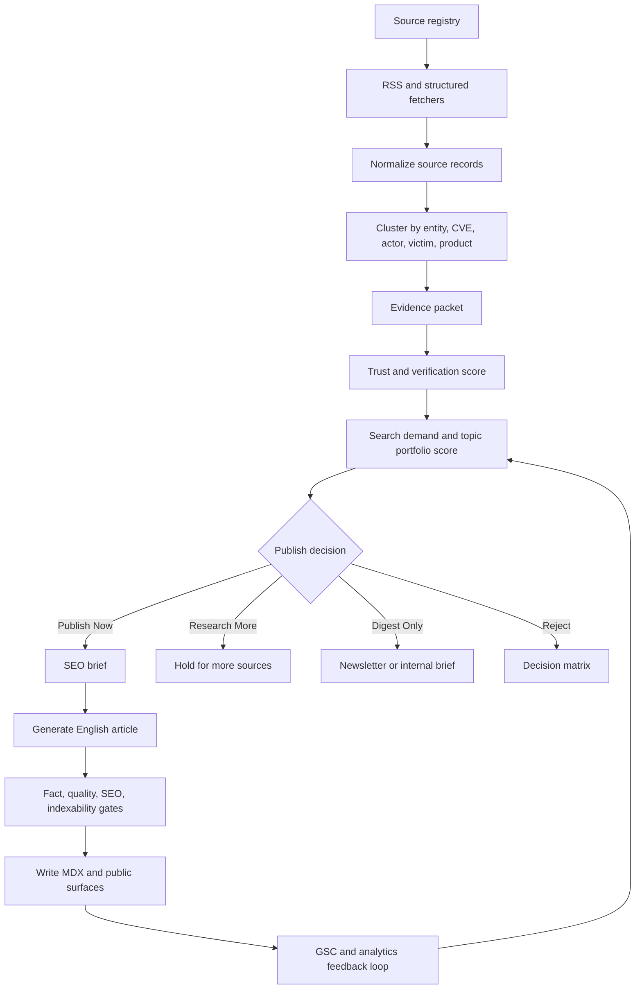

# ZCyberNews SEO Product Pipeline Reset Design

Status: Draft for founder review  
Owner: Alex product lane  
Docs: Noah  
Engineering: Raymond with Vincent architecture review  
SEO/channel: Maya  
Last reviewed: 2026-05-17

## Answer First

ZCyberNews does not need a small SEO patch. It needs a source-to-publish operating system where search intent, source trust, evidence depth, and article quality decide what becomes public before the generator writes anything.

The current production site has repaired many technical indexability problems: sitemap, robots, canonical URLs, hreflang, wrong-section redirects, and noindex regressions are covered by existing audits and smoke checks. The remaining traffic problem is more likely caused by weak crawl priority, thin or duplicate automated articles, insufficient query-first packaging, and a pipeline that still selects too much by recency instead of demand and evidence.

## Problem Statement

The project has been publishing frequently, but publishing frequency is not the same as search visibility. The pipeline can reject bad output after generation, but it does not yet make a strong enough decision before generation about whether a story deserves a public article.

The current behavior creates four product risks:

1. High-volume vulnerability feeds can crowd out ransomware, APT, breach, malware, AI-security, and defender-operations stories.
2. Source metadata exists, but source trust and originality are not strong enough selection inputs.
3. Article generation is SEO-aware at the prompt layer, but there is no explicit SEO brief artifact for each selected story.
4. GSC feedback exists in audit docs, but it is not yet a weekly machine-readable input to the story selector.

## Product Direction

ZCyberNews should become an English-first cybersecurity curation and analysis site. For now, new public publishing should optimize for English search visibility. Chinese content should not be expanded until the English pipeline has stable traffic and quality signals.

Existing Chinese URLs should remain accessible during the reset to avoid creating another SEO migration event. New Chinese generation should be frozen unless a specific task deliberately reopens bilingual publishing with a migration plan.

## Approach Options

### Option A: Prompt-Only SEO Fix

Improve the generation prompt and metadata rules.

Trade-off: Fast, but it does not fix story selection, source trust, or crawl priority. This is not enough.

### Option B: Gate-Only Hardening

Add stricter post-generation quality gates.

Trade-off: Better safety, but it wastes generation budget and still lets weak candidates consume the pipeline before rejection.

### Option C: Search-First Editorial Operating System

Add a pre-generation decision layer that scores candidates by source trust, evidence, search demand, topic portfolio, freshness, and uniqueness. Generate only when the selected cluster has a clear SEO brief and enough evidence for a useful article.

Recommendation: choose Option C. It addresses the root cause and keeps the existing guardrails rather than replacing them.

## Target Architecture

## Core Design

### 1. Source Trust Registry

Every source should have explicit metadata:

- `sourceClass`: primary, government, vendor-advisory, security-research, reputable-media, structured-vulnerability, community, social, forum, unknown.
- `authorityScore`: stable score based on source class and past usefulness.
- `originalityScore`: whether the source tends to break stories or syndicate them.
- `noiseRisk`: press release, webinar, vendor marketing, recap, duplicate mirror, or low-detail advisory.
- `verificationRole`: primary evidence, corroboration, context, weak signal, ingest-only.

Acceptance: story selection can explain why a source increased or decreased publish priority.

### 2. Evidence Packet

Before generation, each cluster should produce an evidence packet:

- canonical entity names: CVE, vendor, product, actor, victim, malware family, sector, region.
- source URLs with role and timestamp.
- concrete facts: CVSS, exploit status, affected versions, record counts, victim confirmation, patch links, IOCs, TTPs.
- gaps and uncertainty: what is missing, disputed, or single-source.
- publish risk: too thin, speculative, vendor PR, duplicate, low search demand.

Acceptance: the generator receives structured evidence, not just raw RSS excerpts.

### 3. Search-First Decision Matrix

The publish decision should combine:

- Evidence score: source depth, primary-source presence, concrete facts, technical detail.
- Trust score: source authority, originality, verification role.
- Demand score: GSC query matches, known high-intent entities, CVE/product/actor searchability, likely defender urgency.
- Freshness score: active exploitation, breaking breach, patch release, ongoing incident.
- Differentiation score: whether ZCyberNews can add a useful angle beyond the source.
- Portfolio score: daily balance across vulnerabilities, ransomware, APT/state actors, breaches, malware, AI security, defender operations, and major policy.

Decision outputs:

- Publish Now: public English article.
- Research More: hold until more evidence arrives.
- Digest Only: newsletter/internal brief, not public article.
- Reject: do not process again unless source changes.

Acceptance: `Decision matrix` explains both published and not-published items in operator-readable language.

### 4. SEO Brief Before Generation

Each Publish Now decision should create a generated SEO brief:

- primary search target: CVE, product, actor, victim, or named incident.
- title angle and SERP promise.
- meta description promise with concrete number or entity.
- article type: breaking update, vulnerability explainer, breach report, ransomware profile, APT analysis, defender guide, weekly brief.
- required sections and structured fields.
- internal links and target hub.
- schema expectation: NewsArticle plus citation/source fields where supported.
- publish tier and sitemap eligibility.

Acceptance: no public article is written without a brief.

### 5. English-Only Public Reset

For the first recovery phase:

- generate new public articles in English only.
- freeze new Chinese translation/publication by default.
- keep existing `/zh` URLs live unless a separate migration task decides otherwise.
- remove new ZH work from the critical publish path so translation failures cannot block or confuse English SEO recovery.

Acceptance: the daily pipeline produces English public articles and records translation as skipped by policy, not as a failure.

### 6. Site Information Architecture

The site should make the crawl priority obvious:

- Home: latest high-confidence public stories.
- Vulnerabilities: high-impact CVEs and patch intelligence.
- Ransomware: groups, victims, TTPs, recovery impact.
- APT and State Actors: campaigns and geopolitical targeting.
- Breaches: confirmed incidents with affected data and organization context.
- Malware: families, loaders, infrastructure, delivery chains.
- AI Security: AI-enabled attacks and AI-system vulnerabilities.
- Weekly Briefing: curated summary, not thin article spam.
- Explainers and hubs: evergreen pages that connect related news.

Acceptance: every public article maps to a section or hub and gets at least three relevant internal-link opportunities when possible.

## Non-Goals

- Do not delete existing Chinese content in this reset.
- Do not redesign the whole frontend before the pipeline decision layer is fixed.
- Do not optimize for article count as a success metric.
- Do not treat Cloudflare caching as the active root cause unless new live evidence proves stale `noindex`, stale sitemap, or crawler-blocking headers.
- Do not apply strict CVE severity rules to non-CVE ransomware, APT, breach, malware, or policy stories.

## Success Metrics

### 3 Days After Deploy

- Production smoke passes for homepage, sitemap, robots, feed, and representative articles.
- New sitemap entries are fresh and canonical.
- GSC may still show low clicks; expected signal is discovery/indexing, not immediate traffic recovery.

### 7 Days After Deploy

- New cohort has no `noindex` or sitemap regressions.
- Decision matrix shows why each candidate was published, held, or rejected.
- Public articles have SEO briefs and evidence packets.
- At least one non-CVE story lane appears in published output when source supply exists.

### 14 Days After Deploy

- GSC has query rows for some new English URLs.
- Crawled-not-indexed rate for the new cohort is lower than the old brief-heavy cohort.
- Top impressions show query-first titles/excerpts, not wire-style summaries.

### 30 Days After Deploy

- More impressions on English public articles and hubs.
- Clear winners by topic lane.
- Weekly selection policy is tuned from GSC data instead of guesses.

## Team Roles

| Role          | Owner   | Responsibility                                    |
| ------------- | ------- | ------------------------------------------------- |
| Product       | Alex    | Scope, cutline, publish policy, success metrics   |
| Docs/Tracking | Noah    | Repo docs, status tracker, owner lanes, decisions |
| Architecture  | Vincent | Pipeline boundaries, contracts, data model review |
| Engineering   | Raymond | Implementation routing, tests, deploy discipline  |
| SEO/Growth    | Maya    | Search demand, SERP packaging, GSC feedback loop  |
| Design        | Ken     | Section/hub UX after pipeline gates stabilize     |
| Process       | Sam     | Review cadence, branch hygiene, retrospective     |

## Source Docs

- `docs/seo-indexability-root-cause-2026-05-14.md`
- `docs/seo-full-audit-2026-05-05.md`
- `docs/seo-ctr-audit-2026-04-18.md`
- `docs/pipeline-contracts-2026-04-22.md`
- `docs/pipeline-chain-audit-2026-04-21.md`
- `docs/pipeline-hardening-2026-05-05.md`
- `docs/pipeline-enrichment-tracker.md`
- `docs/sources-transparency-2026-04-22.md`
- `docs/adr/0001-cdn-caching-next-app-router.md`

## Review Decision

Proceed with a phased implementation plan. Phase 1 should add the pre-generation decision model and English-only policy. Phase 2 should connect GSC/search-demand inputs. Phase 3 should build hubs and internal linking once the candidate selector is stable.
